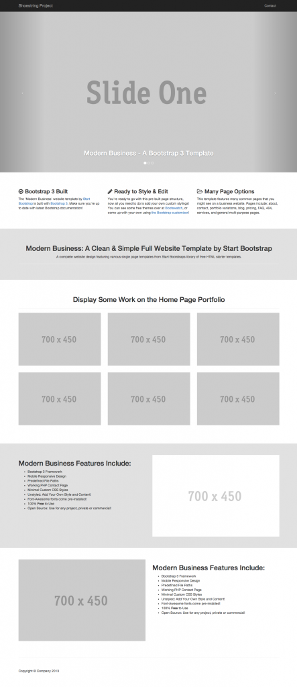
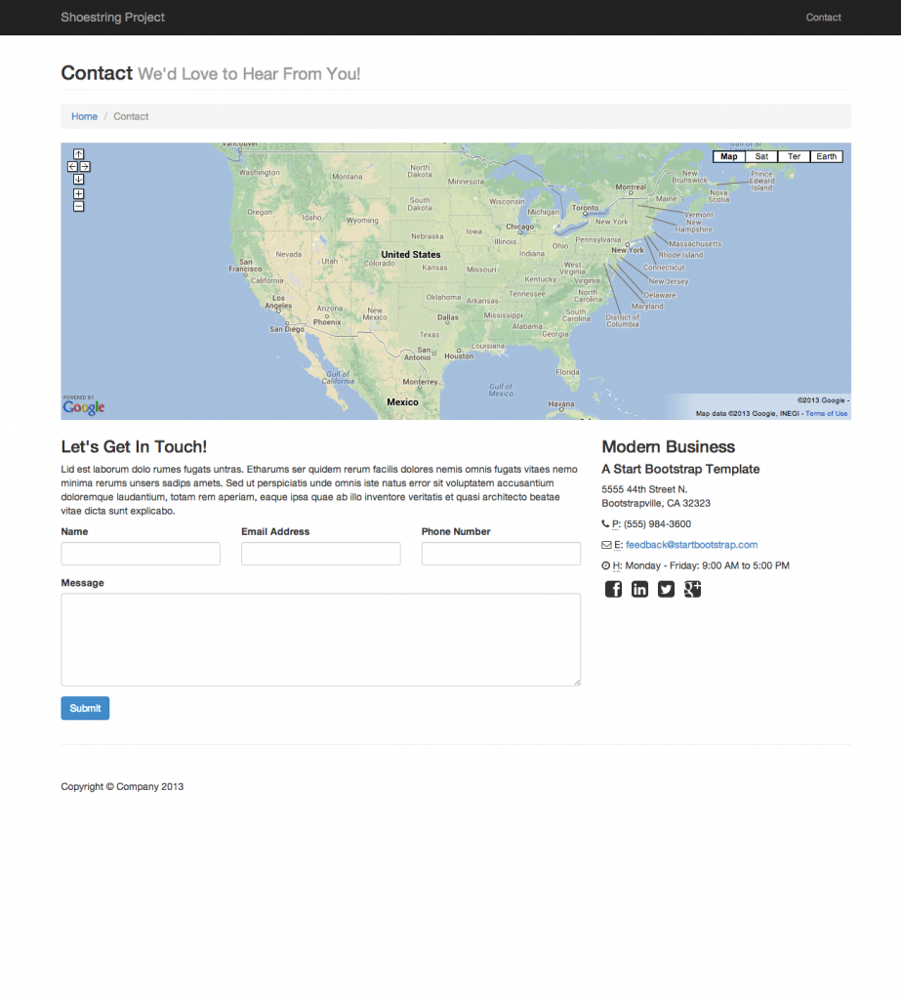

# Shoestring

## Introducción

### Overview & Objetivos

Muchas compañías utilizan un framework CSS para desarrollo rápido y conveniencia. Frameworks populares son diseñados cuidadosamente, compatible a través de muchos browsers, y generoso en características. Sin embargo, hay un contingente de desarrolladores que creen que frameworks como Bootstrap son muy agresivos u opinionados en lo que proveen, y que es mejor construir tu propio framework o escribir estilos propios para cada proyecto. 

En este workshop, vamos a tratar de recrear la vista de un [Template de Bootstrap](http://blackrockdigital.github.io/startbootstrap-modern-business/) sin realmente usar Bootstrap. Para lograr esto, vamos a crear nuestro propio CSS framework - un subconjunto de Bootstrap el cual vamos a llamar 'Shoestring'. Shoestring va a tener tres componentes claves:

- Tipografía
- Grids
- Forms
- También estas alentado a implementar otro componente importante de Bootstrap, el navbar.

A lo largo del camino vamos a aprender sobre construir CSS moderno y semántico usando herramientas como Sass (una extensión del lenguaje CSS de alta-calidad).

## Setup

## Obtén el Repo

Para empezar, forkeá y cloná el repo de Shoestring. Este repo es un esqueleto de una app de Node; en adición de servir como un servidor básico de archivos estáticos, usa Sass (a través de `node-sass`) para compilar archivos SCSS a CSS. 


## Comenzá la App

Abrí la carpeta del proyecto de Shoestring, `npm install` y corre el app:

```sh
$ cd shoestring.js
$ npm install
$ npm start
```

si visitás [http://localhost:3000](http://localhost:3000) deberías ver una versión que parece sin terminar del sitio. Esto es porque nuestra app esta solo parcialmente estilada; necesitamos que termines de darle estilo por nosotros.


### Compilar SASS

Vas a estar escribiendo todo de tu CSS dentro de `assets/stylesheets/shoestring.css`. Un archivo `scss` es específicamente para código de estilo  SASS -- la cual no corre realmente en tu browser! Lo que necesitamos hacer es usar un compilador SASS en orden de transformar este código `scss` a CSS real!

Si mirás en tu `package.json`, vas a ver una propiedad del script `build-css`. Abrí otra terminal (SEPARADA DE donde corrés `npm start`) y corré el comando `npm run build-css`. Este proceso va a ahora a mirar tu archivo `shoestring.css` por cambios y compilar a `public/stylesheets/shoestring.css` el cual esta conectado a nuestro HTML (`layout.html`).  

---

#### Dev vs. Build vs. Serve

Esto resalta una distinción entre el comportamiento en producción y en desarrollo. En nuestra app en producción, queremos solo servir archivos CSS compilados y minificados que ya existen. No esperamos, de hecho, que esos archivos cambien para nada.

Si nosotros como programadores decidimos hacer alteraciones al diseño, eso es realmente un paso del desarrollo. Una vez que editamos nuestros archivos `.scss`, nuestra configuración ideal detecta automáticamente eso y construye nuestro archivo CSS fina por nosotros. Algún tipo de watcher puede luego reiniciar nuestro servidor par aque todos los nuevos requests muestren el diseño actual.   
En general, un proceso *build* es un paso del desarrollo en el cual los archivos siendo trabajados son  construidos / combinados / editados / auditados / cualquier paso hacía producir una app final en producción. Existen muchas herramientas para lograr builds automatizados - Grunt, Gulp, Webpack etc. En este workshop, tomamos a pasos de bebe y solo usamos nuestro gran amigo NPM para hacer el truco con este script `npm run build-css`.

## Sass y Grids

### Intro a Sass

CSS por si mismo no es un lenguaje de programación completo. No soporta conceptos dinámicos como variables, funciones, loops, operadores, etc. Esto hace que crear CSS reusable un verdadero desafío.

Sass (Syntactically Awesome StyleSheets) da a CSS esas capacidades adicionales. Vamos a escribir nuestro Sass usando una sintaxis llamada SCSS, un superset de CSS que es pre-procesado - El script pre-procesador de Sass toma un archivo `.scss` y lo convierte en un archivo `.css` ordinario.     

Sass es un simple add-on pero hace a CSS mucho más poderoso. Repasa las bases de la guía [aquí](http://sass-lang.com/guide)

---

#### Recursos Útiles

Toma un rápido vistazo de estas guías, solo para familiarizarte con donde está la información en cada uno. Podes llegar a necesitar referirte a alguna de la documentación a través de este workshop.

- [Bootstrap CSS](https://getbootstrap.com/docs/3.3/css/)
- [The Bootstrap Modern Theme](https://startbootstrap.com/template-overviews/modern-business/)
- [Normalize.css](http://necolas.github.io/normalize.css/)
- [SCSS Guide](http://sass-lang.com/guide)


### Usando Sass en Nuestra App

Recorre la aplicación y entendé un poco como funciona.

Nuestro servidor de Express usa static routing para enviar páginas HTML comunes (no hay templates hoy!), y también están ya parcialmente estiladas - hay estilos globales definidos en `assets/stylesheets/modern-bussiness.scss`, los estilos del navbar están localizados en `navbar.scss`, y estamos usando `normalize.scss` para dar nuestros estilos compatibilidad cross-browser. Finalmente, todas estas hojas de estilo están siendo importadas en shoestring.scss.

Sin embargo, nuestra app carece de muchos otros estilos, incluyendo disposición o estilo responsivo. No vamos a escribir un archivo `.css` directamente; en cambio, vamos a escribir archivos `.scss` (Sass). Nuestro proceso de build (npm run build-css) va a automáticamente compilar el Sass a vanilla CSS y colocarlo en la carpeta estática `/public/stylesheets` para que este disponible a los clientes.

En consecuencia deberías hacer la mayor parte de tu trabajo `/assets/stylesheets/shoestring.scss`. También podes usar `@import` para separar tus definiciones de archivos en módulos distintos (archivos). Al final, `shoestring.scss` puede comenzar con una serie de `@imports` como:

```css
@import "normalize";
@import "variables";
@import "grid";
@import "form";
```

Cualquier variable que definas en `variables.scss` va a estar disponible en hojas de estilo que lo importen.

**ADVERTENCIA**: No edites ninguno de los archivos CSS que aparecen en `/public/stylesheets`. Dado que estos archivos están siendo generados por el compilador de Sass, son sobrescritos cada vez que el servidor reinicia! Deberías hacer todo tu trabajo en los archivos Sass.


### Grid Systems

Esperamos que para ahora ya hayas visto que un grid system (como el de Bootstrap) hace al diseño de layouts fácil. Aprender como implementar un sistema así por nosotros mismos nos va a ayudar solidificar nuestro conocimiento de CSS. 

Las primeras tres clases que vas a notar en el archivo `home.html` son `container`, `row` y `col-lg-12`. 


| `**container**`                         | `**row**`                                                                   | `**col-lg-12**`                                                                  |
|-----------------------------------------|-----------------------------------------------------------------------------|----------------------------------------------------------------------------------|
| Centrado en la página; borra los floats | envuelve una serie de columnas; la altura se expande a la columna mas larga | Una columna (col) para una pantalla grande (lg) que cubre un ancho de 12 grillas |

Las columnas tienen un par de propiedades:

- Un `padding` definido por el tamaño de el gutter(el espacio entre las columnas) en tu grid layout.
- Un `width` definido por el porcentaje de unidades del grid que toman. En el caso de una columna de 12 unidades de ancho, es facil: 100%. De otra forma, es el número provisto por el nombre de la clase dividido por el numero de unidades del grid, escrito en porcentaje. Debajo hay un estilo básico que completa estos requerimientos. Agregá lo siguiente en tu archivo Sass. No vamos a ver ninguna mejora visual aún, pero empezamos a construir un solido grid framework.

```js
.container {
  margin-left: auto;
  margin-right: auto;
  clear: both;
}

.row {
  clear: both;
}

.col-lg-12 { 
  width: 100%;
}
```


+++SCSS y columnas 
Usar un loop @for nos puede ayudar hacer todas las clases de las columnas (1-12) dinámicamente sin tener que escribir cada una individualmente.  
+++


### Construilo!

Tu trabajo es rellenar el SCSS/CSS requerido para hacer tus páginas HTML principal y contacto se vean como estos dos screenshots. Haciendo eso va a completar este workshop.   

##### NO DEBERÍAS CAMBIAR LOS DOCUMENTOS HTML A MENOS QUE LO DIGA EN EL WORKSHOP

También puedas encontrar [éste articulo](https://css-tricks.com/centering-css-complete-guide/) útil cuando tratás de centrar algo/todo.

Recomendamos primero construir tu propio grid system como fue descripto en el paso anterior. Este grid system debería permitir para un layout correcto en las clases `container`, `row`, `lg` encontradas en `main.html` y `contact.html`. Las clases `md` y `sm` van a ser usadas más adelante. 

Trabaja una `<section>` a la vez y tratá lo mejor que puedas de hacer que el sitio se vea similar a la imagen debajo. Usa padding y margin para hacer pequeños ajustes.

+++Workflow
¿Teniendo problemas con donde empezar?

##### CÓMO PENSAR A TRAVÉS DE ESTE WORKSHOP

- Toma nota de las clases de un elemento
- Basado en como debería terminar visualmente escribí, en español, lo que querés hacer
- Determiná que estilo mejor quedaría en qué clase
- Notá si otros elementos tienen la misma clase y si todos estos estilos tienen sentido para todos esos elementos
- Crea el estilo que refleje tu descripción en ingles


##### AUNQUE QUE TIPO DE WORKFLOW DE ELEMENTOS

- Hace el grid básico
- Continuá con el resto de la primera página (ignorando el carrusel)
- Continuá a la segunda página con el mapa, form, breadcrumbs, etc.
- Hace pequeñas ediciones para acercarte, pero no te estreses mucho sobre la perfección
- Crea un diseño responsivo (siguiendo las acciones del workshop)
- Incorporá código SCSS específico (e.g. loops, mixins, etc)
- Hace el carrusel funcional, perfeccioná el sitio o agrega tu propia onda! 
+++

---

#### Home Page




#### Página de Contacto




## Setup Responsivo

### ¿Qué es el Layout Responsivo?

**NOTA:** asegurate de hacer `git commit -m` en tu actual proyecto Shoestring antes de continuar.

---
 
Re-dimensioná la ventana del browser y notá algunos de los problemas de diseño que ocurren en una dimensión de la ventana más pequeña. 

- ¿Tus ítems del "Porfolio" cambian agradablemente de tamaño?
- ¿Cambian de un layout de 2-columnas a uno de 1-columna cuándo el ancho de la pantalla se hace más pequeño?
- ¿Qué onda con los font-size? ¿Hay alguno qué sea muy grande o muy chico? 

---

En la parte 1 de Shoestring construimos un framework CSS funcional. Ahora vamos a tomar un paso más y hacer el layout responsivo. Para refrescar sobre responsive CSS, [lee esta guía](http://adamkaplan.me/grid/).  y diseño mobile-first son dos lados de la misma moneda; es todo sobre dar al usuario final la mejor experiencia para su tamaño de ventana.

Visitá el [template original](http://blackrockdigital.github.io/startbootstrap-modern-business/) que estábamos tratando de replicar y trata de variar los tamaños ahí. Vas a notar que el diseño de la página se adapta agradablemente. Nuestro objetivo va a ser replicar esos cambios en nuestro propio framework.


### Git Branches

Esperemos que tu compañero y vos estuvieron practicando algo de colaboración básica con Git pusheando y pulleando a Github.

Como mencionamos antes, pushear directamente al master branch puede ser problemático. Si dos personas editan el mismo archivo, merge conflicts pueden aparecer y causar dificultades. Una aproximación mas ordenada es usar branches - versiones paralelas e independientes del tu repo. Commitear a un branch significa que el master branch se mantiene a salvo. Cuando estas listo para hacer un merge de tus cambios a master, tenés que asegurarte primero que tu branch está al día con el trabajo de otras personas. Merge conflicts ocurren en branches aislados, mientras que el master branch debería (en teoría) nunca tener merge conflicts.

---

Configuremos una responsive branch para Shoestring ahora. 
```sh
$ git checkout -b responsive
```

El comando `git checkout -b responsive` es una abreviatura para los dos comandos `git branch responsive` y `git checkout responsive`. Esto crea una nueva branch llamada `responsive` y lo cambia a el. Una vez que hayas terminado tu trabajo en esta branch, podés cambiar devuelta a master y merger tu nuevo código de responsive.


### Actualizá la Vista

Antes de continuar, necesitamos asegurarnos nuestro HTML por si mismo esta configurado para usar las clases responsivas. Cambiá `home.html` a [este gist](https://gist.github.com/guilleasz/2c0f937b0f5a5ade88abae21346a8615). Fijate en el markup los "rows" de tu HTML; vas a ver los atributos como `col-lg-4` `col-md-6` `col-sm-12`. Esto es la estructura de clases del grid de Bootstrap. El esquema de nombrado tiene un significado específico:

- `col-lg-4`: Cuando la pantalla sea de tamaño grande(lg), el ancho de la columna debería ser 4 unidades del grid (un tercio).
- `col-md-6`: Cuando la pantalla sea de tamaño mediano(md), el ancho de la columna debería ser de 6 unidades del grid (un medio).
- `col-sm-12`: Cuando la pantalla sea de tamaño pequeño(sm), el ancho de la columna debería ser de 12 unidades del grid (un entero).


## Ejercicio responsive

### Escribí el Branch Responsive

Hagamos un nuevo archivo llamado `media-queries.scss`. Este archivo debería ser importado a tu `shoestring.scss`, pero al final del archivo para asegurarte una cascada correcta. Recuerda que la última regla CSS declarada va a sobrescribir cualquier regla previa que afecte un elemento.

```css
/* el resto del archivo shoestring.scss */

@import 'media-queries';
```

¿Cómo podés definir las clases responsive de tal manera que apliquen al tamaño de pantalla correcto? Mirá como hacer [media queries en Sass](http://thesassway.com/intermediate/responsive-web-design-in-sass-using-media-queries-in-sass-32). También aquí hay un [tutorial](https://www.smashingmagazine.com/2011/01/guidelines-for-responsive-web-design/) bien escrito y detallado sobre diseño web responsive que debería ayudar.

Agregá las clases necesarias a tu archivo `media-queries` para hacer Shoestring un framework responsive.

+++SCSS y media queries
Considerá crear un @mixin que utilice tu columna @for para dinamicamente crear el tamaño de cada columna (i.e. xs, sm, md y lg). Una vez que te sientas capaz de hacer eso, mira como podés incorporar @each para hacer esto media queries aun más cortos.
+++


### Pull Requests

Una vez que tengas un framework CSS responsivo funcionando, asegurate de hacer `git commit` del responsive branch. Ahora vamos a querer hacer merge de estos cambios devuelta a la master branch.

Podríamos simplemente `git checkout master` y luego usar `git merge responsive`. Sin embargo, eso no sería muy responsable en un equipo. Una procedimiento más civilizado es enviar un pull request en GitHub. Esto señala que tenés trabajo que querés pullear al proyecto principal, y creas un espacio a otros para:

- Comentar en request y preguntar dudas
- Repasar las diferencias entre tu branch y el branch al cual querés hacer merge
- Fijarse si la branch puede hacer un merge automáticamente (sin conflictos)

---

Hagamos un request ahora. Primero, vamos a necesitar hacer un `git push` a nuestra branch en GitHub, ¿Pero cómo hacemos un push a un branch y no a master?

```sh
$ git push origin responsive
```

Luego visitá tu proyecto en GitHub. Deberías ver una nota en el medio de la página al efecto de que la branch responsive fue recientemente publicada, y que podes compararla & hacer un pull request. Presioná ese botón para ser llevado al formulario del pull request. 

Cuando crees el pull request, asegurate que estés comparando tu fork de Shoestring master branch a tu responsive branch, y no al original Shoestring master branch de atralice a tu responsive branch. Usá el menú desplegable para cambiar el base fork al master branch de tu fork.

Nota la notificación verde "Able to merge" a la derecha. Luego, crea un pull request (botón verde a la derecha), y hacé que tu compañero haga el merque del request (botón verde abajo). Ahora que el branch ha sido mergeado, no es más necesario. Así que usa el botón _delete branch_ para removerlo.

Finalmente, usa `git checkout master` y `git pull` en tu maquina local para ver los resultados de tu arduo trabajo. Tus cambios han sido mergeados a master
